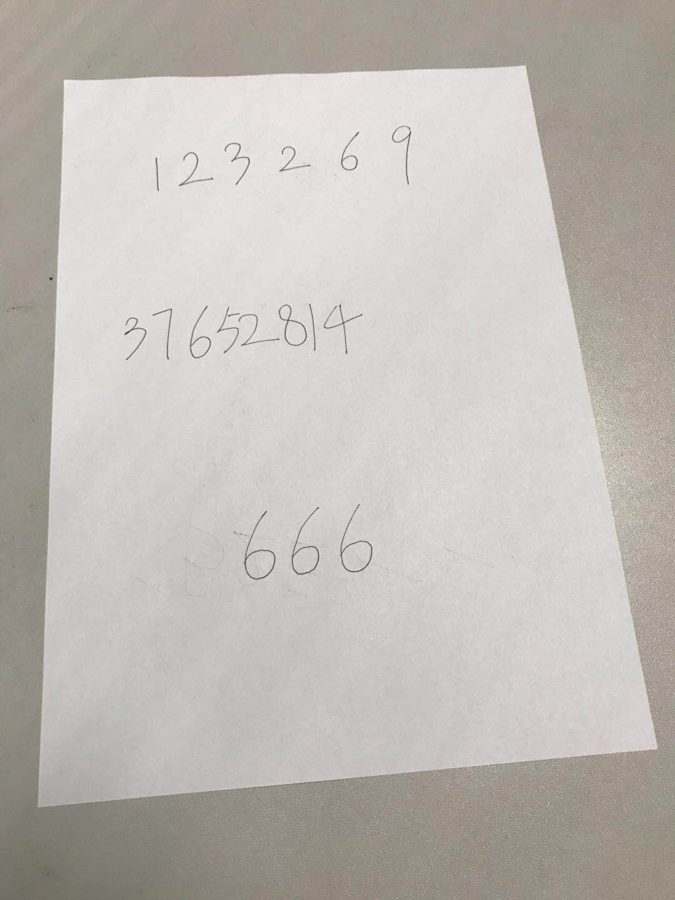
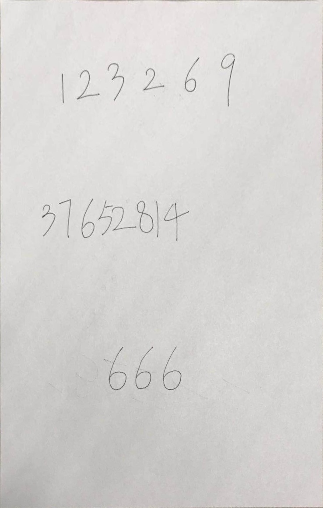
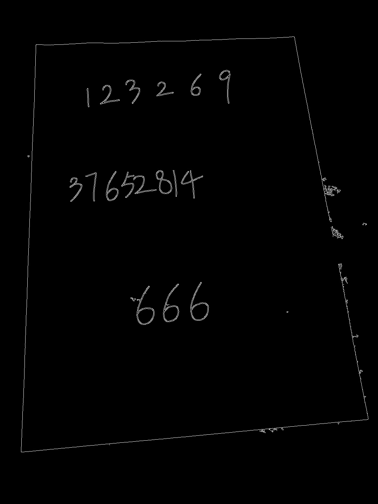

# Image-Correction
## 实验目的
输入一张图像，图像中有一张 A4 纸，通过图像处理的方法将其校正，如下：

  　校正之后－＞　 

## 实验环境
Win 10 系统，使用 python 语言以及 opencv 库

## 实验原理
通过对图像做边缘检测，然后运用霍夫线变换获取图像中 A4 纸的边缘线段，利用线段交点得出图像中 A4 纸的四个角点，然后通过几何图像变换，对 A4 纸通过透视变换进行校正

## 实验步骤
1. 读入图像，传入 imgcorr() 函数，并将图像转为灰度图后做一次高斯滤波，以除去一些干扰噪点，便于边缘检测提取校正内容
```python
 src = cv2.imread("input.jpg")  #读入图像
 
 graysrc = cv2.cvtColor(src, cv2.COLOR_BGR2GRAY)  #转为灰度图
 blurimg = cv2.GaussianBlur(src, (3, 3), 0)	  #对灰度图做高斯滤波		      
```
2. 对滤波后的灰度图做边缘检测提取，应用 opencv 提供的 Canny 函数提取边缘
```python
Cannyimg = cv2.Canny(blurimg, 35, 189)
```
<br>
　　  提取边缘得到的灰度图如下：
 　　 <center>    </center>
    
>这里所用到的 Canny 函数运用了 1986 年 JOHN CANNY 提出的一个很好的边缘检测算法，它根据对信噪比与定位乘积进行测度，得到最优化逼近算子，也就是 Canny 算子。使用 Canny 边缘检测，必须满足以下两个条件：
- 能有效地抑制噪声
- 必须尽量精确确定边缘的位置

>在这里不多加赘述 Canny 算法的具体原理，直接说明 Opencv 中的 Canny 函数的使用：
void cv2::Canny(Mat gray, Mat canny, double threshold1, double threshold2, int aperture_size = 3)
**gray**
 单通道输入图像（灰度图）
 **canny**
 用于储存边缘的单通道输出图像
 **threshold1**
 第一个阈值
 **threshold2**
 第二个阈值
 **aperture_size**
 Sobel 算子内核大小，可省略

>Canny 算法使用了滞后阈值，有两个阈值参数（高阈值和低阈值）：
- **如果某个像素的幅值超过高阈值，该像素被保留为边缘像素**
- **如果某个像素的幅值低于低阈值，则该像素被排除**
- **如果某个像素的幅值在两个阈值之间，该像素仅仅在连接到一个高于高阈值的像素时被保留**
 
3. 再对边缘提取后的灰度图执行霍夫变换得到 A4 纸的边缘直线，并描绘在图像上以便观察，实现代码及结果如下：
```python
lines = cv2.HoughLinesP(Cannyimg, 1, np.pi / 180, threshold = 30, minLineLength = 320, maxLineGap = 40)
   
for i in range(int(np.size(lines)/4)):
    for x1, y1, x2, y2 in lines[i]:
        cv2.line(rgbsrc, (x1, y1), (x2, y2), (255, 255, 0), 3)
```
<br>
　　  通过霍夫变换得到相应的直线描绘在原图上效果如下：
 　　 <center>    </center>
    
 >霍夫变换是一种用来寻找直线的方法，这里所用到的 HoughLinesP 函数就是运用了霍夫变换的原理，事实上，opencv中有两个运用霍夫变换获取线段的函数，分别是标准霍夫线变换 HoughLines 和 统计概率霍夫线变换 HoughLinesP，具体的原理在此也不多加赘述，有兴趣了解的大可谷歌必应一波，我就直接说一下这里用的统计概率霍夫线变换函数 HoughLinesP 的使用：
void cv2::HoughLinesP(Mat src, Mat lines, doublerho, double theta, int threshold, double minLineLength, double maxLineGap)
**src**
 边缘检测的输出图像（二值灰度图）
 **lines**
 用于储存检测到的线段的端点($x_{start}, y_{start}, x_{end}, y_{end}$)的容器
 **rho**
参数极径 r 以像素值为单位的分辨率。我们使用1像素
 **theta**
参数极角 θ 以弧度为单位的分辨率。我们使用1度（即CV_PI/180）
 **threshold**
要检测出一条直线所需最少的曲线交点
 **minLineLength**
能组成一条直线的最少点的数量。点数量不足的直接被抛弃
 **maxLineGap**
能被认为在一条直线上的两个点之间的最大距离

 4. 根据霍夫变换所获得的直线端点，用求直线交点的方式，求 A4 纸的四个角点
```python
//根据上述霍夫变换获得的线段求直线交点，实验证明，霍夫变换获取并存储直线时是横纵方向依次完成的，即只需如下形式计算
 points = np.zeros((4, 2), dtype = "float32")
 points[0] = CrossPoint(lines[0], lines[2])
 points[1] = CrossPoint(lines[0], lines[3])
 points[2] = CrossPoint(lines[1], lines[2])
 points[3] = CrossPoint(lines[1], lines[3])

//根据线段端点计算对应直线交点，原理参考直线点斜式方程联立所解
def CrossPoint(line1, line2): 
    x0, y0, x1, y1 = line1[0]
    x2, y2, x3, y3 = line2[0]

    dx1 = x1 - x0
    dy1 = y1 - y0

    dx2 = x3 - x2
    dy2 = y3 - y2
    
    D1 = x1 * y0 - x0 * y1
    D2 = x3 * y2 - x2 * y3

    y = float(dy1 * D2 - D1 * dy2) / (dy1 * dx2 - dx1 * dy2)
    x = float(y * dx1 - D1) / dy1

    return (int(x), int(y))
```
然而，通过以上方式获取的四个角点的顺序并非规则的矩形角点顺序，还需要通过一定的排序方法对其进行排序，如下
```python
def SortPoint(points):
    sp = sorted(points, key = lambda x:(int(x[1]), int(x[0])))
    if sp[0][0] > sp[1][0]:
        sp[0], sp[1] = sp[1], sp[0]
    
    if sp[2][0] > sp[3][0]:
        sp[2], sp[3] = sp[3], sp[2]
    
    return sp
```
5. 利用 opencv 提供的函数计算透视变换的矩阵，具体的透视变换原理和应用在这里我就不说了，留给大家寄几去学习吧
```python
dstrect = np.array([
        [0, 0],
        [width - 1, 0],
        [0, height - 1],
        [width - 1, height - 1]], dtype = "float32")
  
transform = cv2.getPerspectiveTransform(np.array(sp), dstrect)  #利用原图角点和目标角点计算透视变换矩阵
```
6. 利用 opencv 提供的函数对图像做透视变换得到校正后的图像并输出
```java
warpedimg = cv2.warpPerspective(src, transform, (width, height))

return warpedimg
```
　　  最终图像校正的效果如下：
 　　 <center>    </center>

